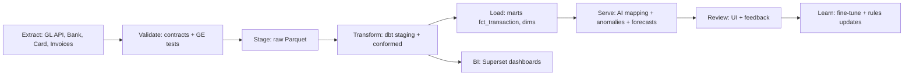

# Distilyze Development Strategy (Standard ETL, Simple First)

**Objective**
We are building a full-stack AI property operator. We own the real estate and we own the AI that runs it. The system ingests the general ledger, invoices, and transactions through an ETL pipeline, then a specialized AI classifies expenses, matches vendors, catches anomalies, and forecasts cash flow. We operate the properties and build the software, so the AI learns from every transaction and compounds efficiency and value.

## Guiding principles
- Keep the pipeline standard and simple. Extract, Validate, Stage, Transform, Load, Serve.
- Make runs idempotent. Every write uses natural keys and upsert logic.
- Validate early. Enforce data contracts and types at the edge.
- Separate raw from conformed. Never mutate raw.
- Human in the loop. Small UI for review and feedback.
- Ship value weekly. Add intelligence only after clean data and metrics.

## Standard ETL flow
1. Extract from GL API, bank, card, and invoice sources.
2. Validate with a data contract. Strong types. Required fields present.
3. Stage into raw and staging Parquet with partitioning by load_date.
4. Transform with dbt into conformed dims and facts.
5. Load marts for finance and ops. Reconcile to source.
6. Serve AI services for mapping, anomalies, and forecasts.
7. Observe lineage, tests, and drift monitors.

## Sprint plan
Each sprint is one week. Milestones follow your 1–2, 3–4, 5+ week blocks.

### Sprint 1 — Bootstrap and data contract
- Provision MinIO, ClickHouse, Postgres with pgvector.
- Create GL data contract and invariants. Strong types for debit, credit, dates.
- Dagster job: pull GL API with paging by next_page_url. Land to raw.gl_line.
- Great Expectations checks on edge. OpenLineage events.
Exit gate: Idempotent upsert by [source_system, txn_detail_integration_id]. Zero schema violations.

### Sprint 2 — Stage and conformed model v0
- Build xref tables for property, unit, and account integration IDs.
- Materialize fct_gl_line from raw, then dim_property, dim_unit, dim_party, dim_coa.
- Materialize fct_transaction with signed amount and reconciled totals.
- Deploy Superset with SSO.
Exit gate: Latest month reconciles within 0.1 percent. Three dashboards live.

### Sprint 3 — Rules and anomaly v1 + review loop
- Rules for common vendors and MCC groups.
- Anomaly types: contract ceiling, service window, duplicate, seasonal z-score.
- Review queue API and simple UI. Persist fct_anomaly and decisions.
Exit gate: False positive rate under 20 percent on backtest. Every decision has reason JSON.

### Sprint 4 — LLM few-shot mapper and OCR
- vLLM service with prompt templates and retrieval from pgvector.
- Donut or TrOCR for invoices. Extract header, totals, dates, service windows.
- Log rationales and human corrections into fct_feedback.
Exit gate: LLM beats rules by 3 points macro accuracy. OCR header fields ≥ 95 percent.

### Sprint 5 — GBM mapper and router
- Train LightGBM features from dims, budgets, seasonality, and contracts.
- Champion–challenger router. Tie break by slice performance and confidence.
- Duplicate detection with embeddings or model.
Exit gate: Router improves accuracy with no regressions on high-risk accounts.

### Sprint 6 — Accruals and amortization proposals
- Service window accruals and prepaid amortization. Reverse on actuals.
- Write proposed_journal for review and export to ERP.
Exit gate: Two months of history show small variance inside tolerance.

### Sprint 7 — Forecasts v1
- Statsforecast baseline. Add GBM residuals where helpful.
- Publish fct_forecast_month and BI cards.
Exit gate: Meets MAPE targets for top spend lines.

### Sprint 8 — Copilot v1
- Tools: read-only SQL templates, document search, anomaly explainer, proposal writer.
- Strict guardrails. Audit all tool calls.
Exit gate: No unrestricted SQL. Outputs cite data and docs.

### Sprint 9 — QLoRA fine-tune
- Build SFT from fct_feedback and corrections.
- Fine-tune and canary deploy behind a flag.
Exit gate: Targeted uplift without regressions on safety slices.

### Sprint 10 — Drift and SLOs
- Evidently monitors for schema, confidence, class mix, and features.
- Define SLIs/SLOs. Add runbooks and alerts.
Exit gate: Test alert and rollback works in a sandbox.

### Sprint 11 — Security and RLS
- Keycloak roles by portfolio and property. RLS policies in ClickHouse and Postgres.
- OpenMetadata ownership and SLAs.
Exit gate: RLS validated and secrets rotated.

### Sprint 12 — Go live
- Go-live checklist. Feature flags recorded. Training and support plan.
- Post-launch review and KPI board.
Exit gate: No P1 incidents in week one. KPIs visible and tracked.

## KPIs
- Mapping accuracy by account class and property cohort
- Autopost rate within policy
- Mean time to decision for low-risk invoices
- Forecast MAPE on top spend lines
- Review queue aging and rework rate
- Drift alerts per month and time to mitigation
