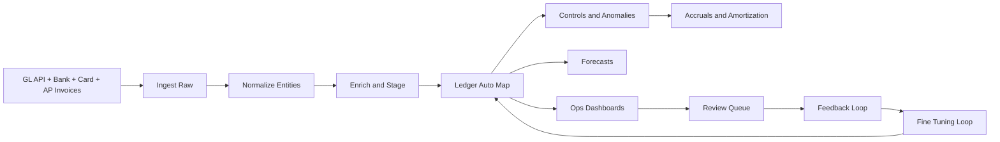
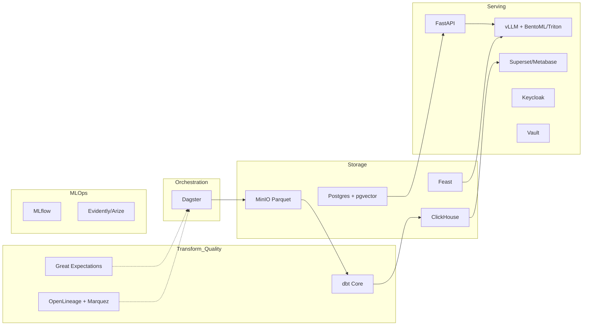
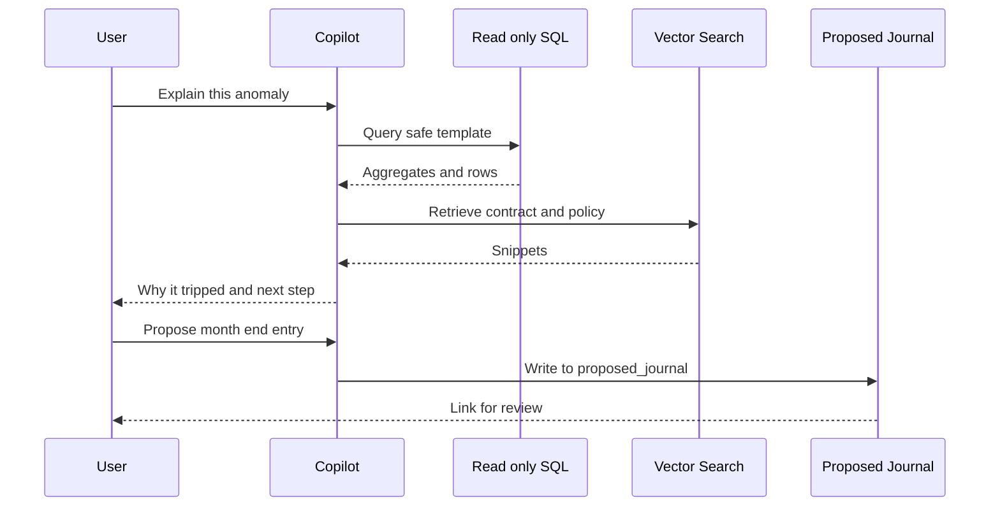

# Distilyze Stack

This document is a human friendly view of `stack.yaml`. It summarizes flows and shows how components connect. Lists and field names live in the YAML as the single source of truth.

## High level flow

## System architecture

## Controls at a glance

- Autopost only when confidence is high, amount is small, and account is non sensitive.
- Everything else routes to review with stored reasons.
- Every change is versioned to keep audit trails.
- Drift monitors watch schema, confidence, and class mix.

## Copilot boundaries

## Timeline summary

- Weeks 1 to 2 ship ingest, normalization, marts, dashboards, and basic rules.
- Weeks 3 to 4 add LLM few shot mapping, OCR, feedback UI, and GBM mapping with tie break by route.
- Week 5 and after add accruals, forecasts, copilot, QLoRA, and drift monitors.
